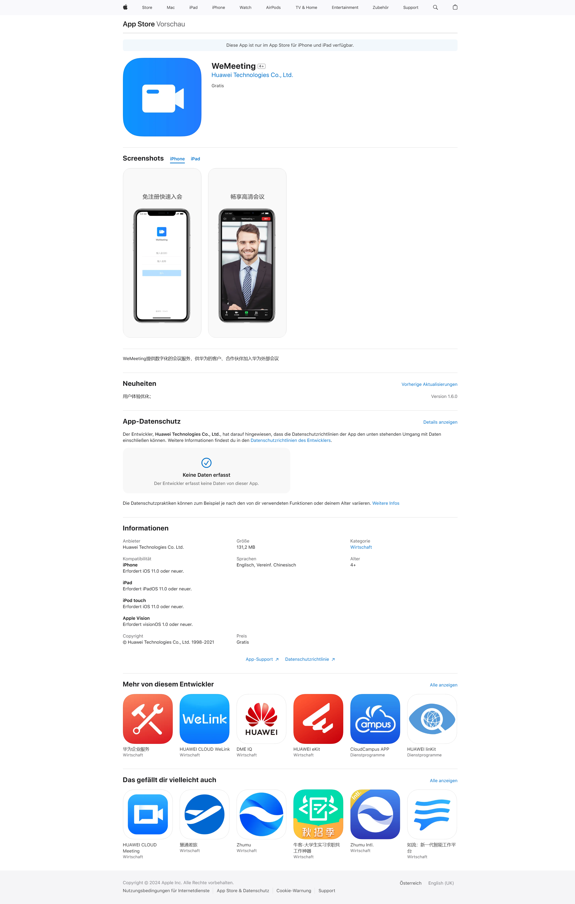
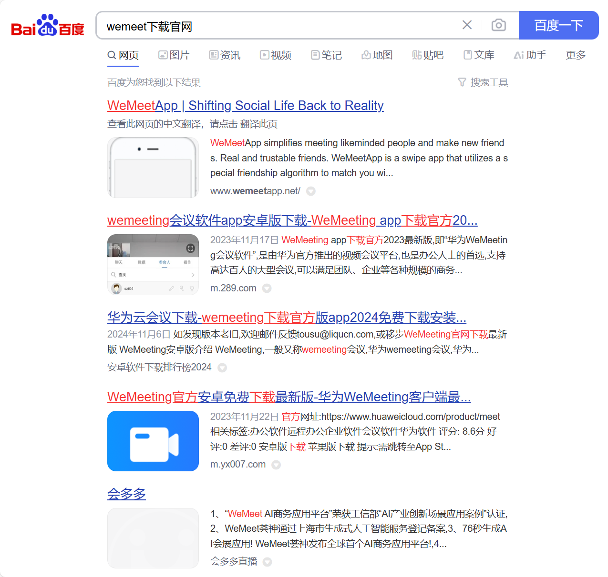
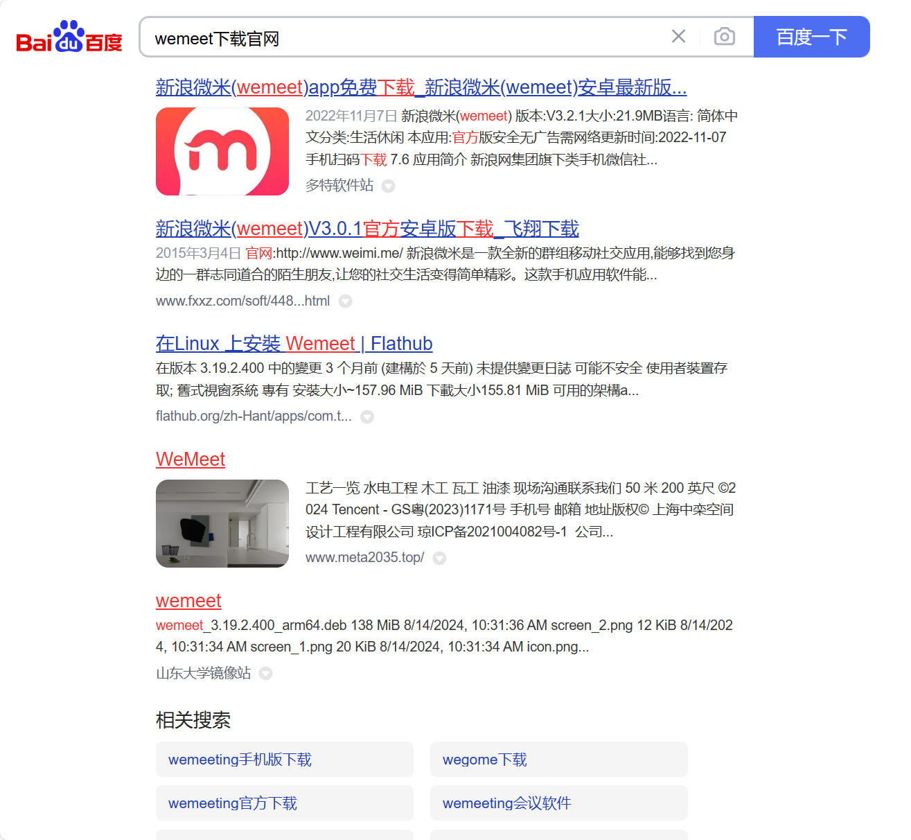

# 故事 1

今天中午和前同事一起在雍和宫附近吃了个饭，老贵了，橘子大小的肉丸子一个就要 48 元。考虑到我最近失业无收入，前同事请了我。感谢曾经的革命友谊。

晚上帮一个朋友解决电脑上的一点小问题。

朋友说他电脑装不上软件，不知道怎么解决，说让我看看能不能重新装一个系统。我拿到电脑后发现，他的电脑是华为笔记本，系统是 Windows11，他想要安装的软件是`.msi`后缀的，我网上查询了一下资料，发现了这其中的端倪。Windows11 系统默认不支持安装`.msi`文件，这种事情倒不至于重装系统那么麻烦。知道了原因就很好办，从网上一查，稍稍一操作，前后不到 10 分钟，问题解决。

关键的地方来了，我在解决问题过程中，无意间看到他电脑上有一个文件夹，名为`wemeet`，眼看这个名字那么熟悉呢？我网上查询了一下这个文件夹对应的软件，居然发现了`wemeeting`的存在。华为在线会议软件就是`wemeeting`。

[AppStore WeMeeting](https://apps.apple.com/at/app/wemeeting/id1480497919)

这就有意思了。

我这个软件该怎么整呢？我取名时也没想那么多啊，就想着我们一起来开会，这不就是 `WeMeeting`嘛。

先做着吧，也许后面会考虑改一下名称。还好现在软件还只是刚刚开始，重新取名啥的还算来得及。

---

2024-11-15 23:01 北京 昌平

## 补充，关于`wemeet`

今天在互联网上又重新搜索了一下这个关键词，发现与`wemeet`有关的产品着实不少。

`腾讯会议`在电脑上的安装目录名就是`WeMeet`

`华为云会议`名称是`WeMeeting`

曾经的新浪出品的一款 APP，微米，似乎也和`wemeet`有关联。

看来随便取的名字真的很容易与其他产品撞名。

改名的事情暂时没有思路，先放放。

---

2024-11-17 09:54 北京 昌平
