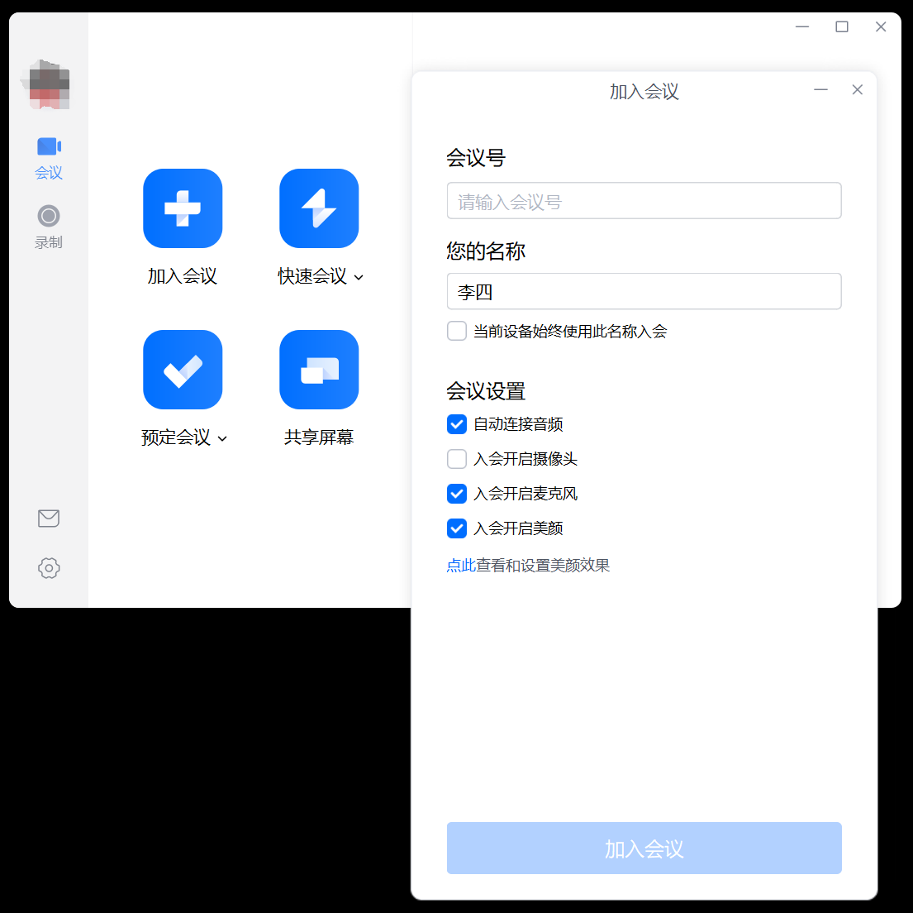

# 腾讯会议核心功能截图

此处针对腾讯会议进行了一些功能上的初步了解，在我们后续的软件设计上可以做一些借鉴学习。

## 思路梳理

用户使用会议软件，首先需要进行账号的`注册`和`登录`，只有`已登录`用户可以进行`会议预定`，`进入会议`等操作。

`已登录`用户有两种主要的状态：`未入会`和`已入会`状态。

`未入会`时，用户可以`预定会议`、`加入会议`。

`已入会`时，用户参加会议，可以进行`语音`、`视频`、`屏幕共享`、`文字聊天`、`分组讨论`等操作。

此外，用户还可以进行一些个性化的设置，例如针对语音、视频等进行设置。

## 缩略图

<table>
  <tbody>
    <tr>
      <td></td>
      <td></td>
      <td></td>
      <td></td>
    </tr>
    <tr>
      <td></td>
      <td></td>
      <td></td>
      <td></td>
    </tr>
    <tr>
      <td></td>
      <td></td>
      <td></td>
      <td></td>
    </tr>
    <tr>
      <td></td>
      <td></td>
      <td></td>
      <td></td>
    </tr>
    <tr>
      <td></td>
      <td></td>
      <td></td>
    </tr>
  </tbody>
</table>

---

## 大图

---

2024-11-16 22:20:10 北京 昌平
